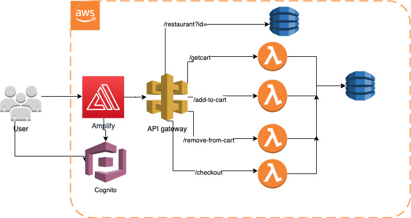

Food Ordering Platform on AWS

Functional requirements:
1.	Displays a static page listing restaurants available
2.	Fetch menu items for each restaurant (Display veg only+ filter)
3.	Get cart
4.	Add/Remove items from cart
5.	User can register via their email ids by confirming the verification code sent to their email id
6.	User after registering can login to website

Non-functional requirements:
1.	Scalability : With the increase in number of users, application should be able to handle the surge in traffic ensuring seamless experience to all users in placing orders.
2.	Availability: App must have no single points of failure. It should be fault tolerant and continue to respond to customer requests when there's a high demand on the service or when there's a maintenance event
3.	Performance: App should load in less than 2 seconds. Website performance measures how quickly the pages of a website load and display in the web browser. This significantly impacts user experience
4.	Security: Since users will make monetary transactions, the interaction between user and website should be highly secure. Using an SSL certificate and data privacy policy will create trust among the website users

The solution  uses a microservices based architecture wherein each individual HTTP verb is isolated and associated with a different application logic(using different lambda for each of the verb. This makes the application more modular and easy of debug in case of any failures/errors. Failure in one functionality doesn’t impact the other.

Flow of website:

1.	User loads the website and gets a list of restaurants to choose from(using Amplify which used Cloudfront and s3 for displaying static content
2.	When user selects a restaurant to order from, it is routed to /restaurant?id= page, which fetches data from API gateway integrated Dynamo DB table MenuItems. This page displays details about MenuItems like name, price, if it is vegetarian/non-vegetarian
3.	On clicking AddToCart for an item, if the user is authenticated, a request to /add-to-cart URL which fetches data from API gateway which  in turn invokes Lambda function Add-to-cart which adds items to exist.
4.	If user is not authenticated, he is redirected to login page to register/log in using his email id. After which he is redirected back to /restaurant page
5.	User can fetch the cart items from cart button in navbar, it is fetched 
6.	They can remove Item, by clicking Delete item in Cart, this will make call to API gateway URL /remove-from-cart which will delete item from Cart.
7.	From the cart, they can click on checkout and will be redirected to /checkout page, where he can enter address and confirm order. After confirming order, it gets put in Dynamo DB table Orders by Api gateway /checkout resource.
8.	Cloudwatch is being used to monitor metrics of individual services as well as Lambda logs.

AWS Services Used:
Amplify for hosting frontend application
 
AWS Amplify provides purpose-built tools and features full-stack applications on AWS. This solution uses Amplify Hosting which provides git-based workflow for hosting full-stack serverless web apps with continuous deployment. This makes it easy to make changes to the application.

Also, Amplify allows managing production and staging environments for frontend and backend by connecting new branches. It provides a handy way to set up authentication for app.

Frontend is built on React be fast and scalable. It is helpful in when app needs to change data, without reloading the page. It makes use of re-usable component which make the code modular and easy to manage

Cloudfront and S3

Amplify uses Cloudfront to deploy frontend. Cloudfront provides the ability to utilize its global network of edge locations to deliver a cached copy of web conten. To reduce response time, the CDN utilizes the nearest edge location to the customer or originating request location to reduce the response time.
Throughput and application performance is significant reduced for subsequent requests served from cache.

S3 is known for its scalability, data availability, security, and performance. In this application, it is being used to serve static content like css files, images. 

API gateway

API Gateway handles all the tasks involved in accepting and processing up to hundreds of thousands of concurrent API calls, including traffic management, CORS support, authorization and access control, throttling, monitoring, and API version management.

By default, API Gateway allows for up to 10,000 requests per second

Its simple integration with Lambda, Dynamo DB along with the ability to customise request/response using mapping templates in integration request and response.

It is easy to maintain, test, quick to deploy and monitor using Cloudwatch metrics and logs. To prevent your APIs from being overwhelmed by too many requests, API Gateway throttles requests to your APIs. Specifically, API Gateway sets a limit on a steady-state rate and a burst of request submissions against all APIs in your account. CORS support has been enabled on API gateway. 

Encryption in transit: TLS on API gateway

 
Lambda 

High availability – Lambda runs the function in multiple Availability Zones to ensure that it is available to process events in case of a service interruption in a single zone

Versioning –Lambda supports versioning to save function's code and configuration while developing it

Scaling – When your function receives a request while it's processing a previous request, Lambda launches another instance of your function to handle the increased load. Lambda automatically scales to handle 1,000 concurrent executions per Region

Testing -Lambda functions can be easily tested using test feature. 

Monitoring- It can be monitored using Cloudwatch metrics like Invocations and cloudwatch logs.

This application logic is built using Nodejs.

Dynamo DB 

No SQL: Amazon DynamoDB is a fully managed NoSQL database service that provides fast and predictable performance with seamless scalability. 
Serverless: DynamoDB takes away the burden of hardware provisioning, setup and configuration, replication, software patching, or cluster scaling. 
High Availability and Durability: DynamoDB automatically spreads the data and traffic for your tables over a sufficient number of servers to handle your throughput and storage requirements, while maintaining consistent and fast performance. All of your data is stored on solid-state disks (SSDs) and is automatically replicated across multiple Availability Zones in an AWS Region, providing built-in high availability and data durability. 
Encryption at rest: DynamoDB also offers encryption at rest, which eliminates the operational burden and complexity involved in protecting sensitive data. This is done using using encryption keys stored in KMS
Scalability/Autoscaling: It store and retrieve any amount of data and serve any level of request traffic. User can scale up or scale down your tables' throughput capacity without downtime or performance degradation

Cognito

This application uses Amazon Cognito User Pools which provide a secure identity store that scales to millions of users. As a fully managed service, User Pools are easy to set up without provisioning any infrastructure. User Pools store user profiles and support authentication for users who sign up directly.

Amazon Cognito provides a built-in and customizable UI for user sign-up and sign-in. JavaScript SDKs for Amazon Cognito to add user sign-up and sign-in pages to your apps.

When Amazon Cognito detects unusual sign-in activity, such as sign-in attempts from new locations and devices, it assigns a risk score to the activity and lets you choose to either prompt users for additional verification or block the sign-in request.

Assumptions

1.	Currently there is a static page for restaurants assuming there are 3 restaurants only. This is dummy page to show how user can select restaurants. This can be optimised mentioned in Optimisation 1
2.	There is menu item details already in Dynamo DB. In actual scenarios restaurant would need to add this data on their own
3.	Serverless architecture is stateless and doesn’t maintain any user session. 
4.	Dynamo DB is using Read Write capacity mode with 2 RCUs and 2 WCUs since average item size is <9 bytes to save costs. See optimisation 4.
5.	User can only add items to their carts when they have logged in
6.	For demonstration purpose, amplify website is being used. User may want to use a friendly domain name to access the website. 
7.	Given the time constraint of the project, the API gateway is not using not using any Access control. This can be done in Optimisation 7
8.	Since scale of users is less, it is assumed that 1000 Lambda currency limit will not be hit.
